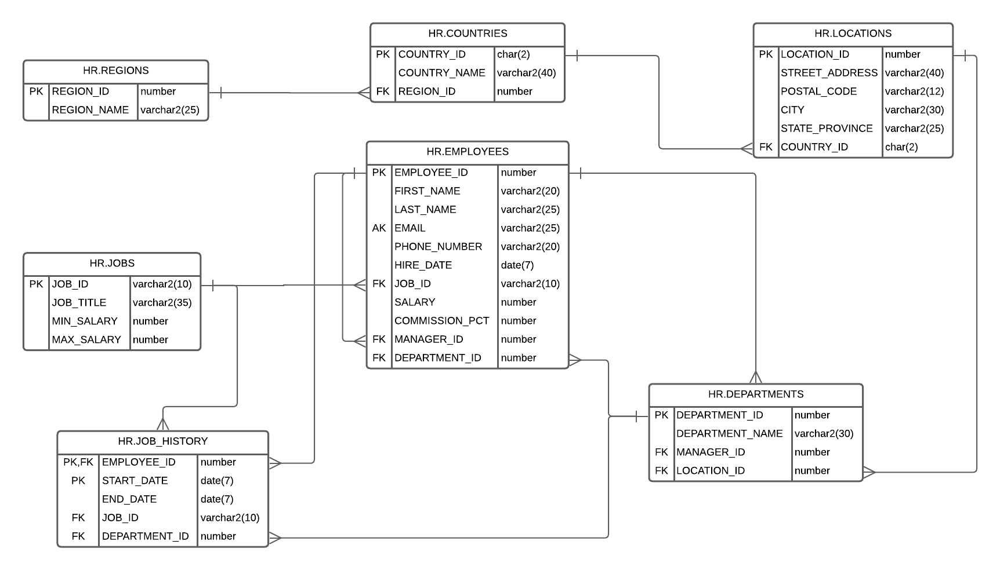

# hsqldb-jpa

Project designed to provide Jakarta Persistence integration with relational database HSQLDB HyperSQL DataBase.

This example uses:
- Java 17
- Hibernate 6
- Jakarta Persistence 3
- Hibernate Validator 7
- HSQLDB > 2.7

## Entity Relationship 

